# Roza

While creating this project I wanted to focus on a personal hobby alongside a hobby which I can create a website I'm proud of. I decided on creating a gym website with the name of ‘Roza’. I wanted this project to give straight forward information for a user who was interested in joining a gym. I took my own opinion along-side friends to figure out what key details they wanted in a gym website which came down to 3 specific details.

A minimalist design, Prices and location. I am giving the website three distinctive colors and a short but memorable name and the prices on the home page allowing for users to know if the gym is for them. The website wants to target users who want a pleasing to the eye website that gives only what's needed to join. 
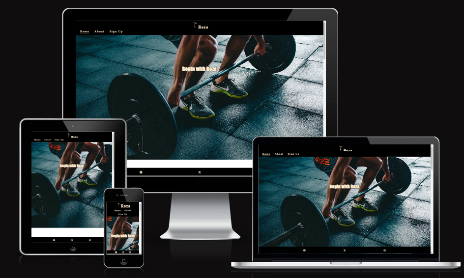

# Planning
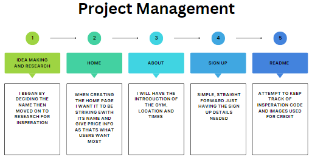

## Users wants 
- As a user, I want to see the prices shown
- As a user, I want to see the times Shown
- As a user, I want to see the location shown

## My Goals
- Get customers

# Features used to achieve goals
- I will firstly have it so the website is responsive to all screen-sizes.
- Having the price and alongside the times showcased after the hero image.
- The location being in the about section which I believe is more fitting.
- socials footer and nav-bar header is fixed for a better user experience. 

# WireFrames

I created wireframes to showcase my project in a simplistic manner using Lucidchart. I will be creating a mobile and desktop screen size wireframe

## Mobile
- [Home](wireframe/phone_home.png)
- [About](wireframe/phone_about.png)
- [Sign Up](wireframe/phone-signup.png)

## Desktop
- [Home](wireframe/desktop_home.png)
- [About](wireframe/desktop_about.png)
- [Sign Up](wireframe/desktop_signup.png)

# Color
I found that blanchedalmond as the text while the background being black was my go too for this website, to gain more contrast i started adding white as the further background for the black making the text stand out even more. I decided to use color contrast https://shorturl.at/eFIPZ to see combinations.

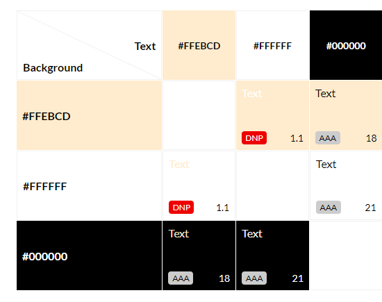

# Features

## Nav Bar
- When starting my website I created a navigation bar for 3 separate pages that's fixed at the top. It can lead the user to Home,About and Sign Up.
- The title is centered with an image next to it giving it a more appealing view that matches the energy the website gives.

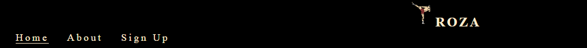

- The nav bar buttons also had a hover design that the changes the colors so it  would pop when hovered.

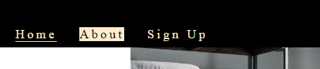

## Home
- The landing page is minimalistic with a straightforward intro stating ‘Begin with Roza’ 
- When scrolling down we then see the most important text, the price tag for 3 different categories of people. Starting from youngest to oldest, Each at different places and  heights for a more striking effect for the user to notice.

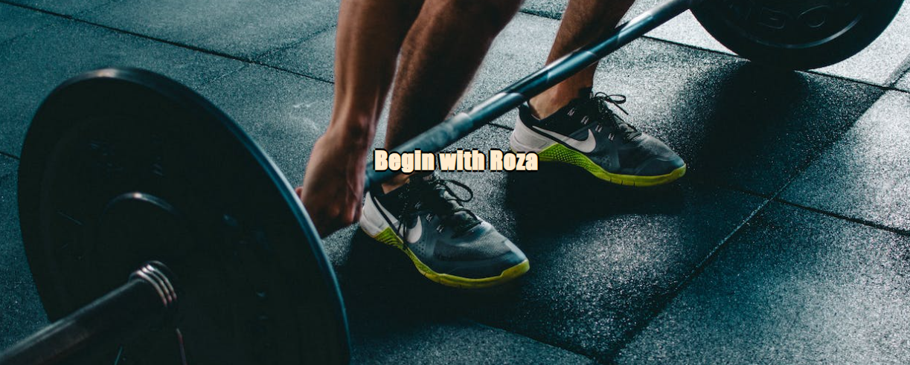

## Footer
- The footer is a fixed feature at the bottom with navigation. It has links that send the user to another tab for the social media of Roza.
- The footer allows for information that improves the usability.

- About
- No images in the about section as I wanted the user to have more focus on the text. Keeping only the two distinctive colors black and blanchedalmond to give more pop and contrast to the text.
- The first page allows the user to know what type of gym they are along-side confirming the type of community they are for a warmer welcome to new gym goers. 
- The second page gives the user the location of the Roza gym which follows the most important 3 details that I decided after researching. 

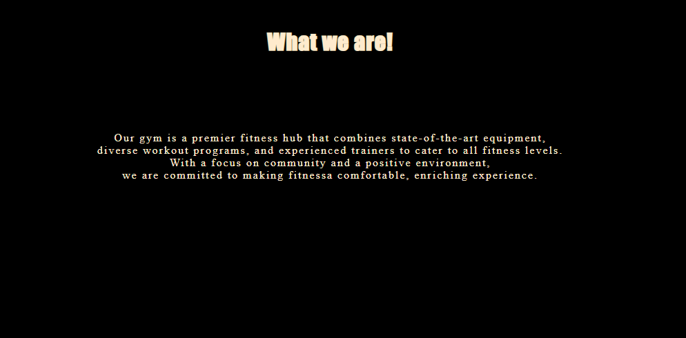

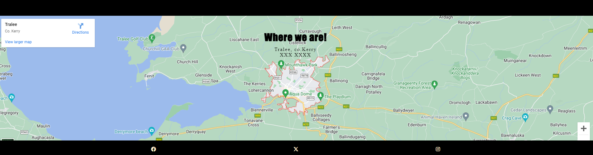

## Sign Up
- I had the sign-up page consist of the age category of the person and email/password. 
- It's simple just giving the user the option to sign up. They are required and have a placeholder.

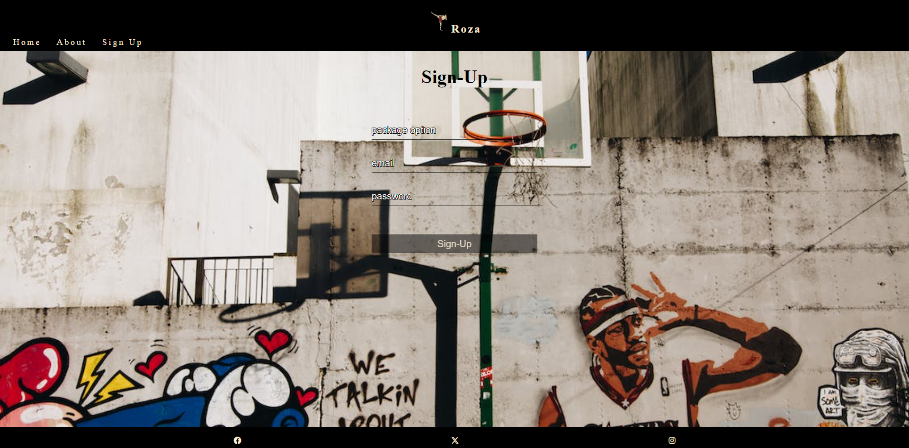

- The submit button also had a hover design that the opacity  would pop when hovered
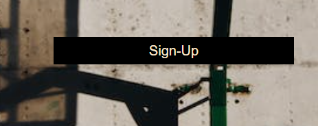

- Feature left to implement
Having the sign up set up differently, such as having it as ‘Login’ and below the submit button there would be a register link if the user doesn't have an account.

- Testing
- From the beginning of the project when adding the smallest detail I'd always look at the website on a different link and continuously check it in the different forms using the dev tools. My features were thoroughly tested and adjusted when issues were faced. Even after I deployed my website I would continuously add and remove code to see what would suit my theme. I began to use #peer-code-review channel on Code Institute´s Slack. Through viewing fellow coders project 1’s I began seeing many issues with my own project to not be at the same level. I decide to change my project for the better as well as gain ideas on how to tackle the Read.me, But my main testing was always focused on screen sizing using dev tools.

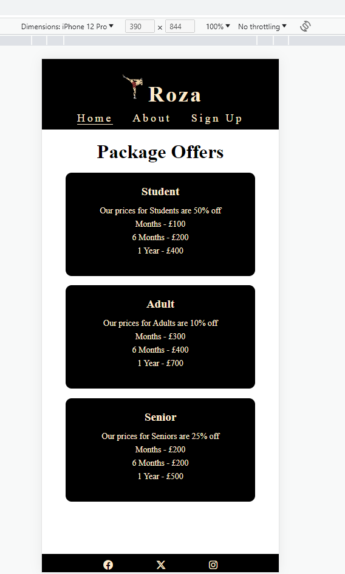

- When I started editing my project again I decide to redesign the prices (old image shown below) page to have background square of black that gives the image more pop which was a hurdle as I could not figure out how to align the two but with w3schools i was able to figure it out https://www.w3schools.com/howto/howto_css_image_text.asp. 
I also decide to redesign the times to be under the prices instead of the about secion for a better user experience (old image below)

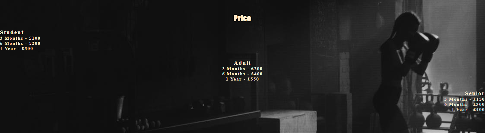

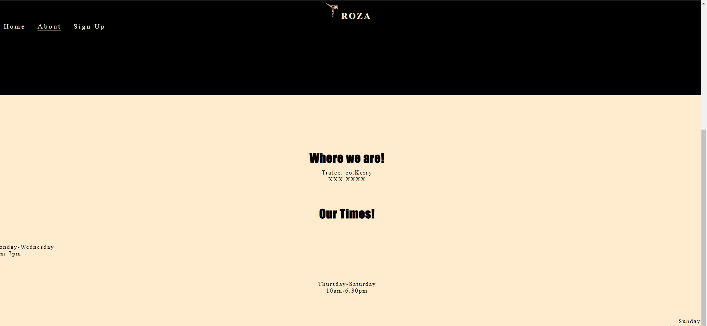

- Making the Header and Footer fixed made me face challenges as I was unaware as to how I should tackle it for a solution. As when I made the black box fixed the text would not align correctly (old image below). I decided to go through the love running project as it had a solution for this so I began attempting to figure out how to implement it into my code. Through repetition of testing my work and using my previous skills I overcome this hurdle.

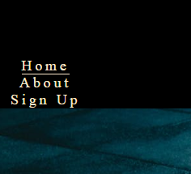

- Previously I nearly gave up on upgrading my sign-up feature but seeing the others in peer-code-review I decided to put my head down and make a better design for my sign-up to give the users more reason to sign up with the website. Youtube videos gave me good ideas on how to face this which is in my credits. (old image below)

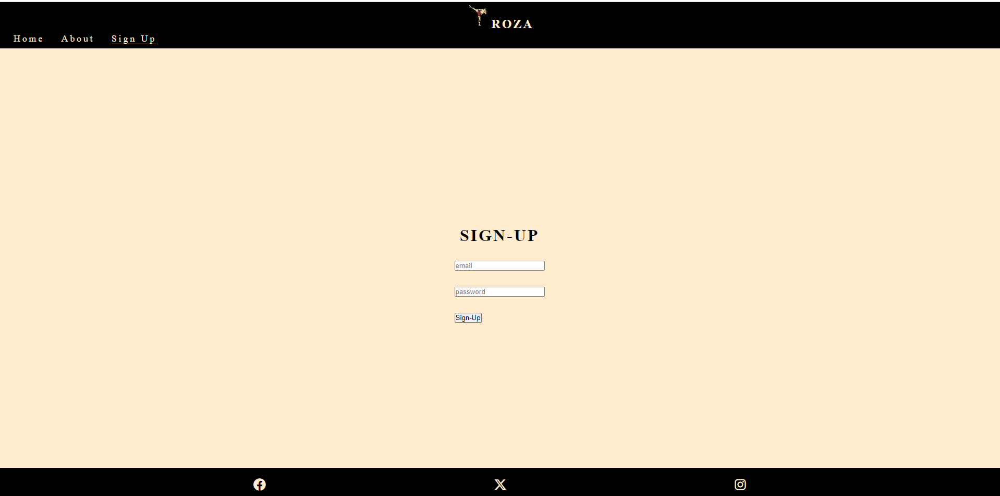

## Lighthouse 
- I would like to increase the performance of my website but my main focus was accessibility for my website as the love-running project was stated to be of most importance. 

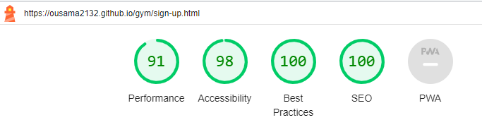

## Validator testing 
- I had used the w3s validator to check if there were any issues with my website, I only foud 1 minor issue which was easily fixed .

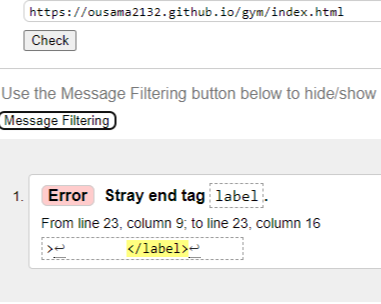
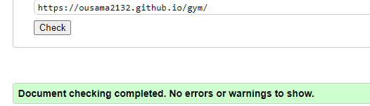

- I had used the Jigsaw validator to check if there were any issues with my website, Honly having 2 minor issues took less then a minute it fix.

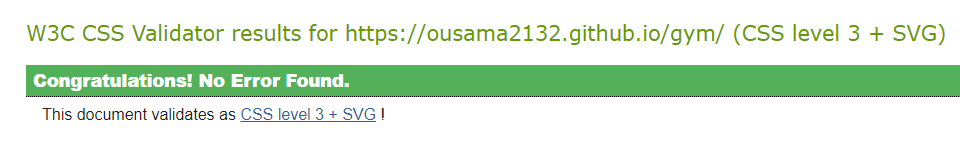
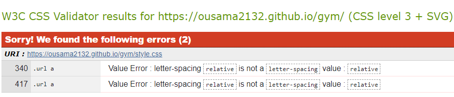

## Users wants 

Colons can be used to align columns.

| User wants        |      Expected Results      | Pass |
| ------------- |:-------------:| -----:|
| As a user, I want to see the prices shown|When going on the website and the user scrolls past the hero image they will be immediately shown prices with color contrast so its well visible | Yes |
|As a user, I want to see the times Shown    | When going on the website and the user scrolls past the hero image and below the price they will be immediately shown times with color contrast so its well visible just as the prices     |   Yes|
|As a user, I want to see the location shown | The location is on the about section very visible as it can still be seen below the about us part. |    Yes |

- Short-Comings
The shortcomings of my website would be if I put the text under the images more visually appealing such as if you hovered over the image you could see the text appear which would improve the experience of the user. .

# Credit
## Content
- Love running project gave me many ideas such as the fixed header -
https://learn.codeinstitute.net/ci_program/diplomainsoftwaredevelopmentecomm. 
- Implementation info-https://www.w3schools.com/howto/howto_css_images_side_by_side.asp , stackoverflow,hover effect-https://css-tricks.com/css-link-hover-effects/. 
## Media
- Images were all from  https://www.pexels.com/search/gym/
- Youtube -https://youtu.be/hr4JiDr7Aec, https://youtu.be/oYRda7UtuhA.
- Icons- https://fontawesome.com/
- Screenshots at the top from https://ui.dev/amiresponsive
- WireFrames from https://balsamiq.cloud/
- Color contrast from https://contrast-grid.eightshapes.com/
- Help to write the readme https://github.com/adam-p/markdown-here/wiki/Markdown-Cheatsheet#headers